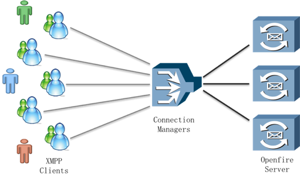
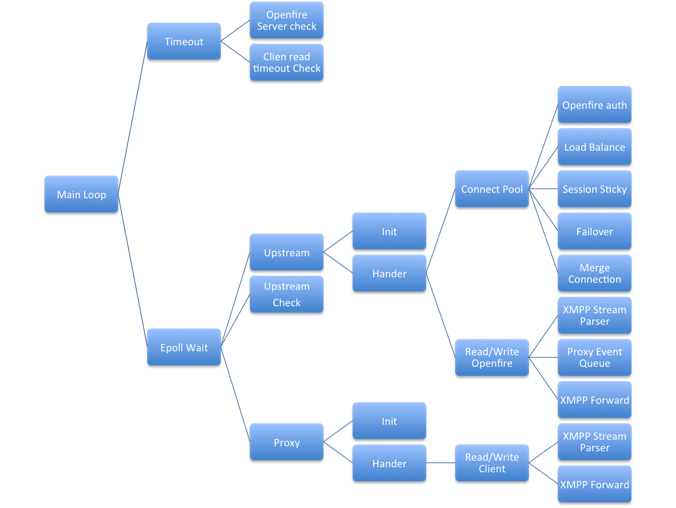

connection_manager
==================

openfire connection manager module

Openfire Connection Manager 是 Openfire 服务器的扩展，它可以透明的处理大规模并发 XMPP 客户端对 Openfire 服务器的联接。上图表示 Openfire 服务器配置 Connection Manager 后的系统架构。实现参考了Openfire的Connection Manager模块(http://www.igniterealtime.org/projects/openfire/connection_manager.jsp)，当前版本尚不支持ssl及zlib压缩。

使用配置
-------------------

	tcp {
		upstream cluster {
			# simple round-robin
			server 127.0.0.1:5262 ;		#openfire server
			server 10.211.55.3:5262;	#openfire server
			connections 5;				#cm与openfire server的最大连接数
			keepalive_timeout 65;		#cm与openfire server keepalive
			server_name test;			#cm名称,唯一
			check interval=10000 rise=2 fall=5 timeout=30000;	#check openfire server配置
		}
	
		server {
			listen 15222;				#cm监听端口
			xmpp_read_timeout 6000;		#cm -> client的read timeout
			xmpp_send_timeout 6000;		#cm -> client的write timeout
			xmpp_buffer 4096;			#client <=> cm 及 cm <=> openfire数据交换buffer
			xmpp_pass cluster;			#cm转发的路径配置
		}
	}

编译安装
-------------------
### a.依赖包安装 
需要确保安装了 
pcre(http://www.pcre.org/) 
expat(http://www.libexpat.org/) 

### b.编译安装 
进入cm目录 
修改Makefile中的PCRE_HOME和EXPAT_HOME值,指向正确的安装路径 
运行 make 进行编译 
编译后的目标文件为./objs/nginx 

### c.可选，安装ha  
cm在部署时，如果需要主备容灾功能，需要部署heartbeat,heartbeat部署相关的，请参考  
 http://www.linux-ha.org/wiki/Main_Page 
 http://www.linux-ha.org/wiki/Heartbeat 
 
原理篇
-------------------
### Connection Manager的总体结构 

感谢使用connection_manager！
